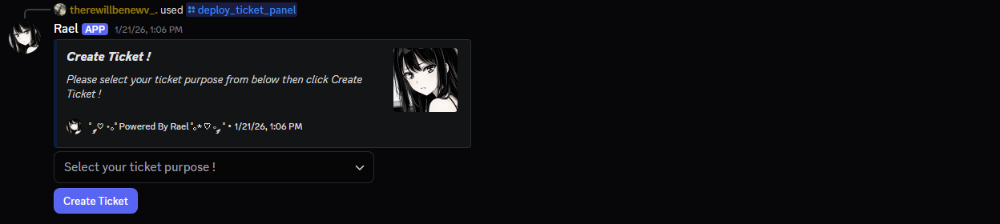
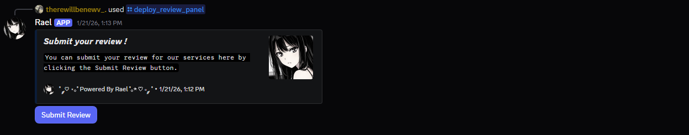

<!-- ========================= -->
<!--        RaelBot README     -->
<!-- ========================= -->


<p align="center">
  
</p>

<h1 align="center">RaelBot</h1>

<p align="center">
  <a href="https://www.python.org/">
    
  </a>
  <a href="https://discordpy.readthedocs.io/">
    
  </a>
  <a href="https://www.gnu.org/licenses/gpl-3.0">
    
  </a>
</p>

RaelBot is a simple Discord ticket bot built in Python using discord.py.

This bot is intended for **server owners with no coding experience** who want a full-featured ticket system.

---

## Features
- Customizable ticket system with two ticket purposes (templates)
- Ticket moderation via buttons and commands
- Ticket transcripts
- Review and feedback system
- Welcome messages and auto role assignment (optional)
- Fully customizable embeds
- Role-based permissions

---

## Preview

<p align="center">
  
  
</p>

---

## Requirements
- **Python 3.10+** – You can download and install it from the [official Python website](https://www.python.org/)
- A Discord bot with all intents enabled (including Message Content Intent)
- Install packages from `requirements.txt` – via pip

---

## Getting Started

1. **Install Git**
   - You can download and install it from the [official Git website](https://git-scm.com/install/)
   - Make sure Git is added to PATH
2. **Clone the repository**:
   ```bash
   git clone https://github.com/iAm-xRa/RaelBot.git
   cd RaelBot
   ```
3. **Install dependencies**:
   ```bash
   python -m venv venv
   pip install -r requirements.txt
   ```
4. **Configure the bot**
   > No coding is required.
   - Open `index.html` in your browser
   - Fill in all the required fields
   - Click the **Copy JSON** button
   - Rename the `config.example.json` file to `config.json` and replace its contents with your copied JSON
   - Rename the `.env.example` file to `.env`
   - Make sure to edit the `.env` file to include your own discord bot token
   - Your `.env` file should look like this:
   > Please follow this example otherwise the bot won't start.
   ```dotenv
   bot_token = "Your_Discord_Bot_Token_Here"
   ```
5. Run the bot
   ```bash
   python bot.py
   ```

---

## Contribution

This project is **provided as-is** for public use.

Pull requests and code contributions are **not accepted.**

---

## Feature Suggestions

You are welcome to suggest new features via GitHub Issues.

Please note:
- Suggestions may or may not be implemented
- This is a solo project
- Pull requests are not accepted

---

## License

RaelBot is licensed under the GNU General Public License v3.0 (GPLv3).

You are free to:
- Use
- Modify
- Share

As long as the project remains **open-source**.
For more details see the [LICENSE](LICENSE) file.
